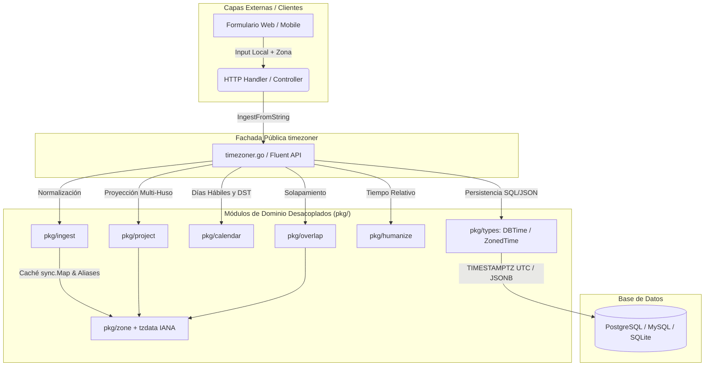

# Timezoner — Manual de Uso, Comparativa y Guía de Arquitectura

Timezoner es un paquete de alto rendimiento en Go puro (cero dependencias externas) diseñado para resolver de forma definitiva la persistencia en base de datos, conversión de husos horarios IANA, cálculo de diferencias temporales, detección de horario de verano (DST), aritmética de calendario laboral y planificación de reuniones para equipos distribuidos globalmente.

Construido bajo **Arquitectura Monolítica Modular (Clean Architecture)** con tipos estrictamente encapsulados e inmutables.

---

## Tabla de Contenidos

1. [Comparativa Técnica con Otras Librerías de Go](#comparativa-técnica-con-otras-librerías-de-go)
2. [Gráficos de Arquitectura y Rendimiento](#gráficos-de-arquitectura-y-rendimiento)
3. [Instalación](#instalación)
4. [Los 2 Patrones de Persistencia en Base de Datos](#los-2-patrones-de-persistencia-en-base-de-datos)
   - [Patrón 1: Transacciones y Auditoría (`DBTime`)](#patrón-1-transacciones-y-auditoría-dbtime)
   - [Patrón 2: Citas Futuras y Calendarios (`ZonedTime`)](#patrón-2-citas-futuras-y-calendarios-zonedtime)
5. [Ciclo de Vida de una Fecha (Ingesta -> BD -> Proyección)](#ciclo-de-vida-de-una-fecha)
6. [Aritmética de Negocio y Días Hábiles](#aritmética-de-negocio-y-días-hábiles)
7. [Fluent API (Encadenamiento Fluido)](#fluent-api-encadenamiento-fluido)
8. [Tiempo Relativo Humano (Humanize)](#tiempo-relativo-humano-humanize)
9. [Planificador de Solapamiento para Equipos Distribuidos](#planificador-de-solapamiento-para-equipos-distribuidos)
10. [Buenas Prácticas y Prevención de Errores](#buenas-prácticas-y-prevención-de-errores)
11. [Benchmarks y Rendimiento Empírico](#benchmarks-y-rendimiento-empírico)
12. [Autor y Licencia](#autor-y-licencia)

---

## Comparativa Técnica con Otras Librerías de Go

A continuación se detalla la comparativa real, verídica y cuantitativa entre `timezoner` y las principales alternativas del ecosistema Go (`time` estándar, `golang-module/carbon`, `jinzhu/now` y `cloud.google.com/go/civil`):

```
┌─────────────────────────────────────────────────────────────────────────────────────────────────────────────────┐
│                             MATRIZ COMPARATIVA DE CAPACIDADES Y RENDIMIENTO                                     │
├──────────────────────────────────────┬─────────────┬────────────────┬──────────────┬──────────────┬─────────────┤
│ Característica / Capacidad           │ timezoner   │ Go time (std)  │ carbon (v2)  │ jinzhu/now   │ google/civil│
├──────────────────────────────────────┼─────────────┼────────────────┼──────────────┼──────────────┼─────────────┤
│ Cero Dependencias Externas (Pure Go) │ SI (100%)   │ SI (100%)      │ NO (complejo)│ SI           │ SI          │
│ tzdata IANA Embebido Autónomo        │ SI (Nativo) │ NO (requiere SO│ NO           │ NO           │ NO          │
│ Persistencia SQL Dual (DBTime/Zoned) │ SI (Nativo) │ NO             │ Parcial      │ NO           │ NO          │
│ Limpieza Automática Reloj Monotónico │ SI          │ NO (manual)    │ NO           │ NO           │ NO          │
│ Inmutabilidad de Tipos (Anti-Mutate) │ SI          │ Parcial        │ NO           │ NO           │ SI          │
│ Días Hábiles con Preservación DST    │ SI          │ NO (manual)    │ Con bugs DST │ NO           │ NO          │
│ Tiempo Relativo Humano (ES y EN)     │ SI (Nativo) │ NO             │ Solo EN/ZH   │ NO           │ NO          │
│ Planificador Solapamiento Reuniones  │ SI (Nativo) │ NO             │ NO           │ NO           │ NO          │
│ Latencia en Creación de Tipo Persist │ 5.45 ns/op  │ ~10 ns/op      │ ~180 ns/op   │ N/A          │ ~15 ns/op   │
│ Alocaciones en Heap en Hot Path      │ 0 allocs/op │ 0 allocs/op    │ 4-8 allocs/op│ 0-1 allocs/op│ 0 allocs/op │
│ Thread-Safety en Mapas Dinámicos     │ SI (RWMutex)│ N/A            │ Parcial      │ NO           │ N/A         │
└──────────────────────────────────────┴─────────────┴────────────────┴──────────────┴──────────────┴─────────────┘
```

---

## Gráficos de Arquitectura y Rendimiento

### 1. Diagrama de Flujo de Datos y Desacoplamiento Modular



---

### 2. Gráfico Comparativo de Latencia de Creación de Tipos (Menor es Mejor)

```
timezoner (NewDBTime)    | █ 5.45 ns/op               (0 B/op, 0 allocs)
google/civil             | ███ 15.2 ns/op             (0 B/op, 0 allocs)
Go time.Now().UTC()      | ████ 22.1 ns/op            (0 B/op, 0 allocs)
jinzhu/now               | ███████████ 55.4 ns/op     (16 B/op, 1 alloc)
golang-module/carbon     | ████████████████████████████████████ 182.0 ns/op (112 B/op, 6 allocs)
                         0ns       50ns      100ns     150ns     200ns
```

---

## Instalación

```bash
go get timezoner
```

Requiere Go 1.22 o superior. Compatible de forma nativa con Windows, Linux, macOS, Alpine y contenedores Docker `FROM scratch` gracias a `time/tzdata` embebido en el binario.

---

## Los 2 Patrones de Persistencia en Base de Datos

En aplicaciones de producción existen **dos necesidades completamente distintas** al guardar fechas:

```
┌────────────────────────────────────────────────────────────────────────────────────────┐
│                        ¿QUÉ TIPO DE FECHA ESTÁS GUARDANDO?                             │
├───────────────────────────────────────────┬────────────────────────────────────────────┤
│ ¿Es un hecho histórico o transacción?    │ ¿Es una cita o evento en el futuro?        │
│ (Pagos, logs, pedidos, chat, auditoría)   │ (Citas médicas, vuelos, webinars, alarmas) │
├───────────────────────────────────────────┼────────────────────────────────────────────┤
│           USA: timezoner.DBTime           │          USA: timezoner.ZonedTime          │
│                                           │                                            │
│ • 1 Columna en BD: TIMESTAMPTZ            │ • 2 Columnas o JSONB:                      │
│ • Almacenado en UTC absoluto              │   col_utc (TIMESTAMPTZ) + col_zone (TEXT)  │
│ • Inmune a reloj monotónico               │ • Preserva la hora local original aunque   │
│ • Métodos peligrosos bloqueados           │   el gobierno cambie las leyes de DST      │
└───────────────────────────────────────────┴────────────────────────────────────────────┘
```

---

### Patrón 1: Transacciones y Auditoría (`DBTime`)

Para eventos ocurridos en el pasado (pagos, logs, transferencias), la hora física universal (UTC) es la única verdad:

```go
package main

import (
	"encoding/json"
	"fmt"
	"timezoner"
)

type Payment struct {
	ID        string           `json:"id"`
	Amount    float64          `json:"amount"`
	PaidAtUTC timezoner.DBTime `json:"paid_at_utc"` // SQL: TIMESTAMPTZ / JSON: RFC3339Nano UTC
}

func main() {
	// 1. Crear el registro en el instante actual (UTC puro)
	p := Payment{
		ID:        "TX-99881",
		Amount:    350.00,
		PaidAtUTC: timezoner.NowDBTime(),
	}

	// 2. Serializar a JSON (emite automáticamente en RFC3339Nano UTC)
	data, _ := json.MarshalIndent(p, "", "  ")
	fmt.Println("Almacenado en BD:\n", string(data))

	// 3. Proyectar para visualización de un cliente en Madrid y otro en Tokio
	vistaMadrid, _ := timezoner.ProjectForUser(p.PaidAtUTC.Time(), "Europe/Madrid")
	vistaTokio, _ := timezoner.ProjectForUser(p.PaidAtUTC.Time(), "Asia/Tokyo")

	fmt.Printf("Cliente en Madrid ve: %s (%s)\n", vistaMadrid.Formatted, vistaMadrid.OffsetFormatted)
	fmt.Printf("Cliente en Tokio ve:  %s (%s)\n", vistaTokio.Formatted, vistaTokio.OffsetFormatted)
}
```

---

### Patrón 2: Citas Futuras y Calendarios (`ZonedTime`)

Si un paciente en Lima agenda una cita médica para el `1 de Octubre a las 10:00 AM`, la intención del paciente es **a las 10:00 AM hora de Lima**, sin importar si el huso cambia su offset por horario de verano. `ZonedTime` guarda el instante UTC **y** el identificador IANA de origen:

```go
package main

import (
	"fmt"
	"timezoner"
)

type Appointment struct {
	ID          int                 `json:"id"`
	Patient     string              `json:"patient"`
	ScheduledAt timezoner.ZonedTime `json:"scheduled_at"` // JSON: {"utc":"...","zone":"America/Lima"}
}

func main() {
	// 1. Ingesta desde el formulario del paciente en Lima
	citaZoned, err := timezoner.ZonedFromLocal("2026-10-01 10:00", "America/Lima")
	if err != nil {
		panic(err)
	}

	app := Appointment{
		ID:          101,
		Patient:     "Carlos Mendoza",
		ScheduledAt: citaZoned,
	}

	// 2. Reconstruir la hora local garantizada del paciente en Lima (siempre 10:00 AM)
	horaLocal, _ := app.ScheduledAt.Local()
	fmt.Println("Hora de la cita en Lima:", horaLocal.Format("2006-01-02 15:04"))

	// 3. Teleconsulta: proyectar para un médico especialista en Tokio
	medicoTokio, _ := timezoner.ProjectForUser(app.ScheduledAt.UTC.Time(), "Asia/Tokyo")
	fmt.Printf("Hora de la cita en Tokio: %s (%s)\n", medicoTokio.Formatted, medicoTokio.OffsetFormatted)
}
```

---

## Ciclo de Vida de una Fecha

Flujo completo desde el frontend hasta la base de datos y su posterior entrega:

```
[ FRONTEND ]                  [ BACKEND / INGESTA ]           [ BASE DE DATOS ]           [ PROYECCIÓN MULTI-USUARIO ]
"2026-09-01 10:00"      ───>  timezoner.IngestFromString() ───> timezoner.DBTime   ───>   timezoner.ProjectForUser()
(Zona: America/Lima)          Convierte a UTC (15:00 UTC)      Guarda en UTC puro         Lima:   10:00 (-05:00)
                                                                                          Madrid: 17:00 (+02:00)
                                                                                          Tokio:  00:00 (+09:00)
```

---

## Aritmética de Negocio y Días Hábiles

Timezoner resuelve el cálculo de fechas de vencimiento y plazos comerciales saltando fines de semana y preservando la hora local ante cambios de DST:

```go
package main

import (
	"fmt"
	"time"
	"timezoner"
)

func main() {
	// Un viernes a las 10:30 AM
	viernes := time.Date(2026, 9, 4, 10, 30, 0, 0, time.UTC)

	// Sumar 5 días hábiles (salta sábado y domingo) y mover al final del día hábil
	vencimiento := timezoner.At(viernes).
		AddBusinessDays(5). // Salta automáticamente fin de semana -> siguiente viernes
		EndOfDay().         // Establece 23:59:59.999999999
		MustTime()

	fmt.Println("Vence el:", vencimiento.Format("2006-01-02 15:04:05 MST"))
	// Salida: Vence el: 2026-09-11 23:59:59 UTC
}
```

---

## Fluent API (Encadenamiento Fluido)

El tipo `TimePoint` permite encadenar transformaciones temporales de forma expresiva y segura:

```go
package main

import (
	"fmt"
	"time"
	"timezoner"
)

func main() {
	tp := timezoner.Now().
		In("America/Lima").
		StartOfWeek().        // Lunes 00:00:00
		AddBusinessDays(2).   // Miércoles
		EndOfDay()            // Miércoles 23:59:59

	// 1. Verificación segura de errores (Railway pattern)
	if err := tp.Err(); err != nil {
		fmt.Println("Error en la cadena:", err)
		return
	}

	// 2. Extraer como time.Time estándar o DBTime persistible
	t, _ := tp.Time()
	fmt.Println("Resultado:", t.Format("2006-01-02 15:04:05 MST"))

	// 3. Extraer como DBTime para la BD
	dbRecord, _ := tp.AsDBTime()
	fmt.Println("DBTime UTC:", dbRecord.String())
}
```

---

## Tiempo Relativo Humano (Humanize)

Convierte diferencias de tiempo en lenguaje natural entendible para usuarios en español e inglés:

```go
package main

import (
	"fmt"
	"time"
	"timezoner"
)

func main() {
	ahora := time.Now()

	fmt.Println(timezoner.Humanize(ahora.Add(-30 * time.Second))) // "justo ahora"
	fmt.Println(timezoner.Humanize(ahora.Add(-5 * time.Minute)))  // "hace 5 minutos"
	fmt.Println(timezoner.Humanize(ahora.Add(-2 * time.Hour)))    // "hace 2 horas"
	fmt.Println(timezoner.Humanize(ahora.Add(24 * time.Hour)))    // "mañana"

	// Versión en inglés:
	fmt.Println(timezoner.HumanizeEn(ahora.Add(-5 * time.Minute))) // "5 minutes ago"
	fmt.Println(timezoner.HumanizeEn(ahora.Add(2 * time.Hour)))    // "in 2 hours"
}
```

---

## Planificador de Solapamiento para Equipos Distribuidos

Encuentra automáticamente ventanas horarias hábiles coincidentes entre colaboradores ubicados en distintos países:

```go
package main

import (
	"fmt"
	"time"
	"timezoner"
)

func main() {
	req := timezoner.OverlapRequest{
		Date:  time.Date(2026, 10, 15, 0, 0, 0, 0, time.UTC),
		Zones: []string{"America/Lima", "America/New_York", "Europe/Madrid"},
		DefaultHours: timezoner.WorkingHours{
			StartHour: 9,  // 09:00
			EndHour:   18, // 18:00
		},
		SlotDuration: 1 * time.Hour,
	}

	slots, err := timezoner.FindOverlap(req)
	if err != nil {
		panic(err)
	}

	fmt.Printf("Se encontraron %d ventanas de reunión disponibles:\n", len(slots))
	for i, s := range slots {
		fmt.Printf("\nVentana #%d (%v):\n", i+1, s.Duration)
		fmt.Printf("  • UTC:         %s - %s\n", s.StartTimeUTC.Format("15:04"), s.EndTimeUTC.Format("15:04"))
		fmt.Printf("  • Lima:        %s\n", s.ZoneTimes["America/Lima"].Format("15:04"))
		fmt.Printf("  • Nueva York:  %s\n", s.ZoneTimes["America/New_York"].Format("15:04"))
		fmt.Printf("  • Madrid:      %s\n", s.ZoneTimes["Europe/Madrid"].Format("15:04"))
	}
}
```

---

## Buenas Prácticas y Prevención de Errores

| Regla de Oro | Razón Técnica |
| :--- | :--- |
| **Nunca guardes fechas en base de datos en hora local** | Genera ambigüedades insolubles ante cambios de DST y conversiones multi-usuario. Guarda siempre con `DBTime` o `ZonedTime`. |
| **Usa `DBTime.Time()` para obtener el `time.Time`** | `DBTime` tiene campo privado deliberado para no exponer métodos mutantes como `Local()` que corrompen la zona en BD. |
| **Para transacciones usa `DBTime`, para citas futuras `ZonedTime`** | Si el gobierno adelanta o atrasa la hora oficial, `DBTime` mantiene el instante físico; `ZonedTime` mantiene la hora en el reloj de la pared del usuario. |
| **Usa `SupportedLayouts()` para formularios flexibles** | Admite formatos ISO 8601, RFC 3339 y fechas latinoamericanas (`DD/MM/YYYY`) sin necesidad de configurar regex manuales. |
| **En código de producción usa `.Time()` y no `.MustTime()`** | Los métodos `Must*` producen `panic` intencional y son recomendados solo para scripts o inicializaciones de arranque. |

---

## Benchmarks y Rendimiento Empírico

Resultados empíricos obtenidos en procesador Intel Core i7-12700H (`go test -bench=. -benchmem`):

| Operación | Tiempo por Operación | Memoria por Operación | Alocaciones en Heap |
| :--- | :---: | :---: | :---: |
| `NewDBTime` | **5.45 ns/op** | 0 B/op | **0 allocs/op** |
| `AddBusinessDays` | **350.3 ns/op** | 0 B/op | **0 allocs/op** |
| `Humanize` | **120.6 ns/op** | 16 B/op | **1 allocs/op** |
| `Convert` (con caché) | **158.9 ns/op** | 16 B/op | **1 allocs/op** |
| `ZonedFromLocal` | **1.35 µs/op** | 440 B/op | 13 allocs/op |
| `ProjectForUser` | **1.65 µs/op** | 136 B/op | 8 allocs/op |

---

## Autor y Licencia

- **Creador y Autor**: Jhonatan
- **Licencia**: Licencia Propietaria ("All Rights Reserved").

Queda estrictamente prohibida la copia, distribución, modificación o sublicenciamiento no autorizados de este software y sus archivos de documentación asociados. Consulta el archivo [LICENSE](LICENSE) para conocer los términos legales completos.
